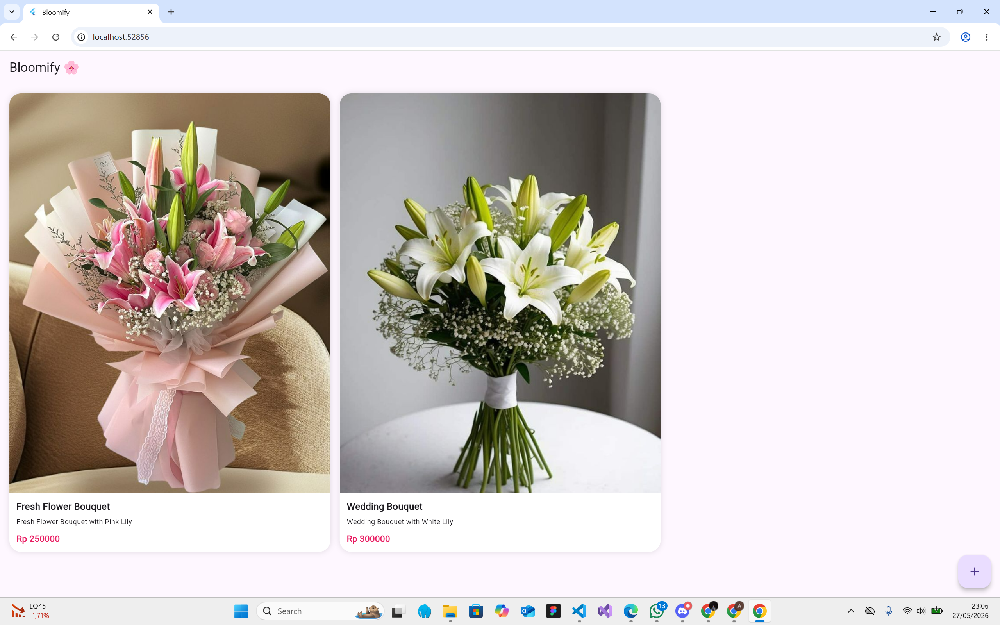

# Bloomify Camera App

Bloomify adalah aplikasi mobile sederhana berbasis Flutter yang memungkinkan pengguna menambahkan produk bunga menggunakan kamera atau upload gambar dari galeri, lalu menyimpannya ke Supabase.

## Features
- Capture image from camera
- Upload image from gallery
- Upload image to Supabase Storage
- Save product data to Supabase Database
- Responsive flower product grid UI

---

## Tech Stack
- Flutter
- Dart
- Supabase
- Image Picker

---

## Screenshots

### Home Screen



### Add Product Screen


---

## Run Project

```bash
flutter pub get
flutter run